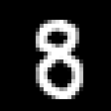

# Digit Classification

This is my 4th year *emerging technologies* assignment. There are two main parts: a [Jupyter Notebook](https://jupyter.org/) which trains a neural network on the [MNIST dataset of handwritten digits](http://yann.lecun.com/exdb/mnist/) step by step using [Keras](https://keras.io/), in order to later classify digits drawn by a user using a simple web application written using [Flask](https://www.fullstackpython.com/flask.html).

## Notable files in this repo

* **/model**: files relating to the Keras model (neural network)
  * **model.ipynb**: Jupyter Notebook; building, training, and evaluating the neural network.
  * **model.h5**: neural network model serialized to a file (for use in the Flask web application)

* **/flask**: files relating to the Flask web application
  * **app.py**: entry point to the web application
  * **image_ops.py**: image operations (decoding from POST request, "MNISTifying", image to model input, etc)
  * **static/**: static resources (main page, styling)
  

## How to run the web application

*Prerequisites: Python 3, TensorFlow, Keras, Flask. Install using [pip](https://pypi.org/project/pip/) and/or [Anaconda](https://www.anaconda.com/distribution/)*

Run **python3 app.py** from the *flask* directory.

(or **python app.py**, depending on your installation)

The TensorFlow warnings can safely be ignored.

Visit **http://127.0.0.1:5000/** in your web browser to view the web application.

## Using the web application

Draw a digit on the canvas using your mouse. When you release left click, the digit you drew should be classified automatically and displayed below the canvas. Clicking "Clear" erases the whole canvas.

## How to make changes and run the model in Jupyter Notebook

*Prerequisites: Python 3, TensorFlow, Keras, Flask. Install using [pip](https://pypi.org/project/pip/) and/or [Anaconda](https://www.anaconda.com/distribution/)*

Run **jupyter lab** from the *flask* directory.

From here you can edit and re-run the notebook (which will also output a new **model.h5** file)

## How the model works

You can read the [Jupyter Nobtebook](https://github.com/Ronan-H/digit-classification/blob/master/model/model.ipynb) to see how the model works, which has code separated out into cells, with some markdown inbetween explaining what each part does.

## "MNISTifying" user drawn digits

Users draw a digit on a large (200x200) canvas, and the model classifies 28x28 digits, so the image has to be at least be resized before being fed into the model. But if we copy the way the digits were resized in the MNIST dataset...

> The original black and white (bilevel) images from NIST were size normalized to fit in a 20x20 pixel box while preserving their aspect ratio. The resulting images contain grey levels as a result of the anti-aliasing technique used by the normalization algorithm. the images were centered in a 28x28 image by computing the center of mass of the pixels, and translating the image so as to position this point at the center of the 28x28 field.

> (from http://yann.lecun.com/exdb/mnist/)

...the predictions should be much more accurate, so that's what I did. I broke this down into 4 steps:

Start with the user drawn image:

 

 

1. Crop image to fit digit

 

 

2. Extend image out into a square (width, height become whichever is bigger)

 

 

3. Scale the image down to 20x20, and expand edges out to 28x28 (image gets aliased while doing this)

 

 

4. Center digit within image based on Center of Mass

 

 

Doing this produces images that are more or less indistinguishable from digits from the MNIST dataset.

## Adaptive canvas brush stroke size

Another thing I did to make predictions even better is make the canvas brush size on the client grow/shrink after the user has drawn a digit, based on the size of the digit they drew. In other words, if you draw a really small digit, the brush size will shrink, so when it later gets MNISTified (see above), the brush size won't look too thick. This would be a problem when you try to draw a small 6 for example, where the brush size is so large relative to the digit that there is no hole after being scaled down, so it might get incorrectly classified as a 1.

## Canvas image encoding

The easiest way to send the canvas data up to the web server is to use *canvas.toDataURL()*, producing a PNG encoded image, sent up as Base64 text. I decided to make my own encoding, taking advantage of the fact that the canvas pixels are always either black or transparent (appearing to the user as black or white). 

The first encoding goes through the image pixel by pixel, counting up how many white/black pixels there are in a row. Once the value changes from black to white or white to black, this value is recorded in an array. Doing this gives you an array that looks something like [183, 5, 3, 3, 50, 6, ...], meaning 183 white pixels followed by 5 black pixels followed by 3 white pixels... etc. I later found out that this is called a [Run-length encoding](https://en.wikipedia.org/wiki/Run-length_encoding). This in itself is a huge improvement on PNG in terms of size in memory.

The next encoding is a lot more pedantic. We now have an array of numbers, being represented in presumably UTF-8 or something similar. At best, that means that when this array is converted to text for the post request, each character will be represented using one byte. However, we're only using the values 0-9 and a comma (the brackets are redundant). That's 11 values, which can be reperesented using only 4 bits (since 2^4 = 16). Conveniently, this is half a byte, so we can represent two characters from this number array in a single byte. So to use this sort of encoding, I had to make use of bitwise operations to encode/decode characters. These bytes are then converted to Base64 so they can be sent in the POST request payload.

Here are the results (in terms of space efficiency) after drawing the number 3 as a test:

**PNG (baseline)**: 2634 Base64 characters

**Run-length encoding**: 904 text characters

**Further encoding (2 chars per byte)**: 604 Base64 characters

So, these two encodings, when used together, produce a Base64 string which is 4-5 times smaller than PNG, depending on what was drawn. Of course, there may be some overhead in terms of speed (since the image has to be encoded on the client side in Javascript, and then decoded on the server in Python), but the classifications became noticably quicker after implementing these, and PNG encoding/decoding isn't free either.
